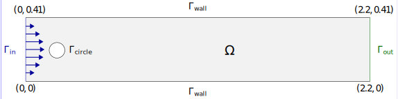

.. _step-2:

*********************************************
Example 2: Solving the linear Stokes equation
*********************************************

.. contents::
    :local:

Introduction
============

In this tutorial we will look at how *ideal.II* handles coupled problems.
If you are unfamiliar with coupled problems in general, 
we recommend going through 
`example step-22 <https://dealii.org/current/doxygen/deal.II/step_22.html>`_
of *deal.II*, which solves the stationary version of the Stokes equation 
solved in this tutorial step.

The Stokes equation is a coupled problem between a vector-valued velocity 
:math:`\bf u\in\mathbb{R}^d` and a scalar-valued pressure :math:`p\in\mathbb{R}`.

.. maths-equation:: Stokes equation in strong formulation

    The strong formulation reads as follows:

    .. math:: 

        \partial_t \mathbf{u} - \nu\Delta\mathbf{u} +\nabla_x p = 0\text{ in }Q \\
        \nabla_x\cdot \mathbf{u} = 0 \\
        \mathbf{u} = \mathbf{g}_D \text{ on }\Gamma_D\times I\\
        \partial_n\mathbf{u} = 0\text{ on }\Gamma_N\times I\\
        \mathbf{u} = \mathbf{u}^0 \text{ on }\Omega\times\{0\}

    with kinematic viscosity :math:`\nu\in\mathbb{R}`.

Weak formulations of the Stokes equation
----------------------------------------

For the weak formulation we need to choose function spaces for the velocity and 
pressure. 
For the velocity we will use the vector-valued version of the function space
we used in the heat equation, 
i.e. :math:`\mathbf{u}\in\mathbf{X}=X(I,\mathbf{H}^1_0(\Omega))`.
For the pressure we use :math:`p\in Y=L^2(I,L^2(\Omega))`.

By multiplying the strong formulation with matching test functions 
:math:`\mathbf{v}\in\mathbf{X}, q\in Y` and integrating over :math:`Q`
we obtain:

.. maths-equation:: Stokes equation in weak formulation

    Find :math:`\mathbf{u}\in\mathbf{X}+\mathbf{g}_D, p\in Y`
    such that:

    .. math:: 
         &(\partial_t \mathbf{u},\mathbf{v}) 
         + \nu(\nabla_x {\mathbf{u}},\nabla_x \mathbf{v}) 
         - (p,\nabla_x\cdot \mathbf{v}) \\
         &+ (\nabla_x\cdot\mathbf{u},q) = 0\\
        &\mathbf{u}(0,x) = \mathbf{u}^0(x) \text{ in }\Omega
        
As in step-1 we allow for discontinuities between two temporal elements
in the function space for :math:`\bf{u}` and obtain:

.. maths-equation:: Stokes equation in discontinuous weak formulation

    Find :math:`\mathbf{u}\in\widetilde{\mathbf{X}}+\mathbf{g}_D, p\in Y`
    such that:

    .. math:: 
         \sum\limits_{m=1}^M &(\partial_t \bf{u},\bf{v})_{I_m\times\Omega}
         + \nu(\nabla_x {\bf{u}},\nabla_x \bf{v})_{I_m\times\Omega}\\
         &- (p,\nabla_x\cdot \bf{v})_{I_m\times\Omega}
         +(\nabla_x\cdot\bf{u},q)_{I_m\times\Omega} \\
         \sum\limits_{m=0}^M &+ ([\mathbf{u}]_m,\mathbf{v}_m^+)_{I_m\times\Omega}= 0 
        
For the temporal discretization we do the same steps as before
and for the spatial discretization we have to use inf-sup stable element
combinations. The simplest of these is the Q2/Q1 Taylor-Hood element 
with biquadratic elements for the velocity and bilinear elements for 
the pressure.

Problem statement
-----------------

The problem was originally formulated as the 2D-3 benchmark problem for the 
nonlinear Navier-Stokes equations in [TurSchaBen1996]_. 
The problem describes laminar flow of a fluid through a channel with a cylindrical
obstacle, as shown in the following image:

For the pressure we prescribe homogeneous Neumann conditions 
on all  boundaries and for the velocity we prescribe the following:

* A parabolic velocity profile on the inflow :math:`\Gamma_\text{in}`
* no-slip,i.e. homogeneous Dirichlet conditon on the obstacle 
  :math:`\Gamma_\text{circle}` and channel walls :math:`\Gamma_\text{wall}`
* A homogeneous Neumann condition on the outflow :math:`\Gamma_\text{out}`

We scale the inflow condition by a sine functions along the 
temporal domain :math:`I=(0,8)` and obtain

.. math::
    \mathbf{u}_x &= \sin(\pi t/8)(6y(H-y))/(H^2)\\
    \mathbf{u}_y &= 0

with channel height :math:`H=0.41`.

Technical details
-----------------

Non-zero Dirichlet boundary conditions
^^^^^^^^^^^^^^^^^^^^^^^^^^^^^^^^^^^^^^

In the previous tutorial we passed a ``dealii::ZeroFunction``,
to ``interpolate_boundary_values``.
In this tutorial we will define our own ``PoisseuilleInflow`` function
to pass for the left boundary (id 0) according to the grid file.

The important difference to stationary problems is that we want to
prescribe a time-dependent function. 
Conveniently, *deal.II* already supports time-dependent functions 
through the methods ``set_time()`` and ``get_time()`` and 
they are used internally in *ideal.II*. 

Handling vector valued problems
^^^^^^^^^^^^^^^^^^^^^^^^^^^^^^^

For coupled problems the syntax of the ``FEValues`` family of functions
is different to *deal.II*, where you would use 

.. code:: c++

    const dealii::FEValuesExtractors::Vector velocities(0);
    dealii::Tensor<1,dim> phi_v = fe_values[velocities].value(i,q);

The call ``fe_values[velocities]`` returns a reference to a 
``FEValuesViews`` object, which have to be stored in a local cache.

To reproduces this behaviour, *ideal.II* would need to store a cache 
of caches which is not easy to maintain and expand. 
Therefore, appropriate functions for the different extractor types
and respective derivatives are provided and the evaluation of the 
basis function instead reads

.. code:: c++

    const dealii::FEValuesExtractors::Vector velocities(0);
    dealii::Tensor<1,dim> phi_v 
        = fe_values_spacetime.vector_value(velocities,i,q);

The commented program
=====================

.. cpp-example:: ../../examples/step-2/step-2.cc

Results
=======

The below videos show the animation of the results for default parameters.
The first shows the velocity magnitude 
:math:`\sqrt{\mathbf{u}_x^2+\mathbf{u}_y^2}` 
and the second shows the pressure.
Since the inflow is scaled by a sine function we can see the 
velocity slowly rising at the boundary.

.. video:: ../_static/examples/step-2-velocity.ogv
    :loop:
    :height: 800
    :autoplay:

.. video:: ../_static/examples/step-2-pressure.ogv
    :loop:
    :height: 800
    :autoplay:

The plain program
=================
    
.. cpp-example-plain:: ../../examples/step-2/step-2.cc

References
============

.. [TurSchaBen1996] Schäfer, M., Turek, S. et. al *Benchmark computations of laminar flow around a cylinder* Vieweg+Teubner Verlag, 1996